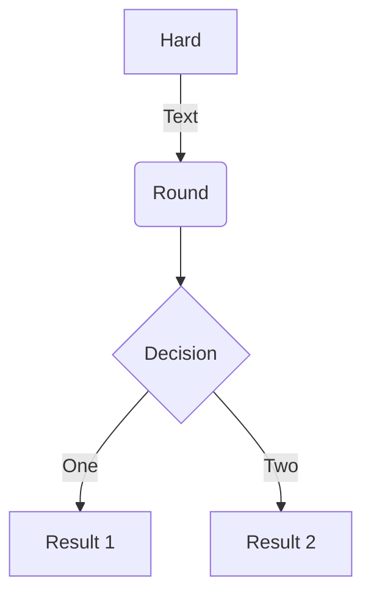

---
aliases:
  - aaaa
export_properties:
  - aliases
export_path: ~/Downloads/{note_name}aa
---
# Test Note for 2HTML Export

This note contains complex elements to ensure the 2HTML plugin captures the DOM snapshot correctly.

## 1. Dataview
```dataview
TABLE file.ctime AS "Created"
FROM "2html-dev-vault"
LIMIT 3
```

## 2. Mermaid Chart


## 3. Local Image embed
![[test-image.png]]

## 4. Multi-column Callout CSS
> [!info] Multi-column Layout
> This is a test of a custom callout or multi-column layout CSS snippet logic.

> [!info|left]
> Addition note to the main article

Content of the main article
> [!multi-column]
>
>> [!note]+ Work
>> ![[test-image.png]]
>
>> [!warning]+ Personal
>> your notes or lists here. using markdown formatting
>
>> [!summary]+ Charity
>> your notes or lists here. using markdown formatting

## 5. Standard Markdown
*   List item 1
*   List item 2
    *   Sub-list item

**Bold** and *Italic* and ==Highlighted== text.
